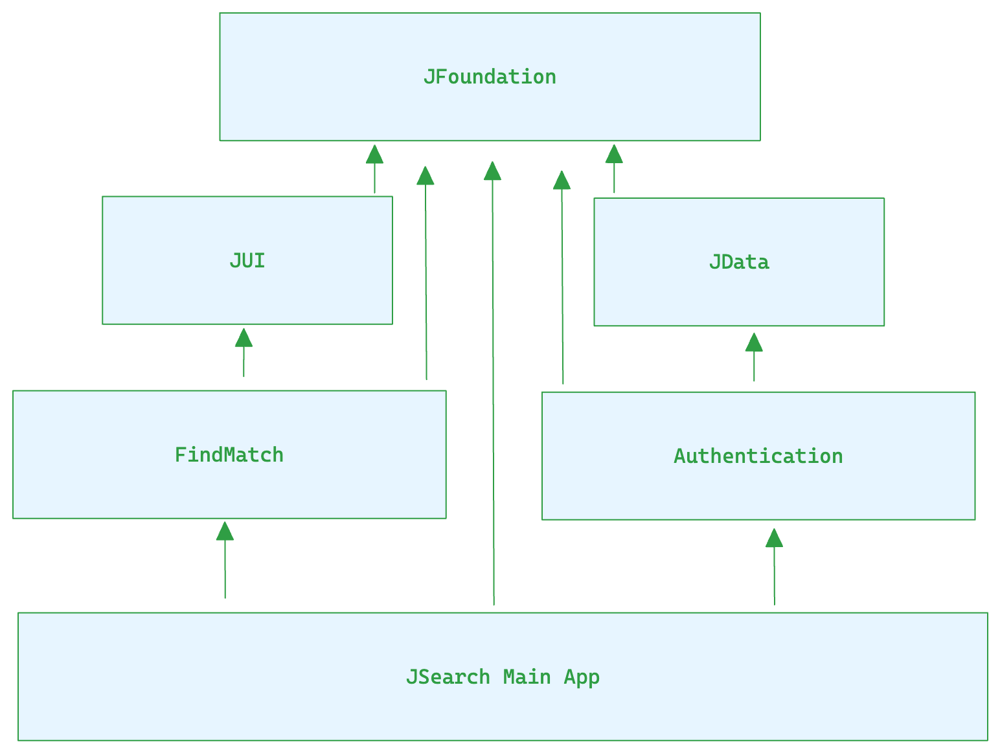

# JSearch App

The main bundle and app target.

As all the implementation and logic are under its referred package, the main app is only responsible for importing and using. Basically, it holds the routers needed and handles the main navigation.

### Routers

- MainRouter: The main one in `AppDelegate`, which creates and starts the `FindMatchRouter`.
- FindMatchRouter: Factories the `FindMatch` flow, starting with `ShiftsViewController`. It can open its view controllers like `FiltersViewController` and `KaartViewController`. When login or signup is tapped, it starts the `AuthenticationRouter`.
- AuthenticationRouter: Factories the `Authentication` flow, it may be whether `LoginViewController` or `SignUpViewController`.

# Decisions

### Setup

- Latest Xcode
- Minimum iOS version is 15.0 for the main target and packages.

### Dependency Management

As requested, it uses the Swift Package Manager.

In order to split the code and responsibilities, also enhance the build time, it is arranged like this:

- JSearch: Main target.
- JUI: Design System and UI code.
- JData: Network and Data layer.
- JFoudation: Shareable utilities and extensions.
- FindMatch: Package for FindMatch features.
- Authentication: Package for Authentication features.

There is no dependency cycle.

### Design Pattern

It is under MVVM with a Router.

- Model: Response and model protocols representing the data source.
- View: The SwiftUI views and screens which expect referred view models.
- ViewModel: Bind the model to view. The view models don't know about the views, but they supply the data needed to be rendered. Also, handle the user interactions and call the referred router when needed.
- Router: Handles the navigation and factories the entities needed.

### Hybrid

It heavily uses SwiftUI for most of the view as it is easy to implement and handle, especially with the Combine framework. But, in order to show UIKit features, it is used for navigation `UINavigationController` and to wrap the SwiftUI view into a `UIHostingController`. So the Routers are agnostic of UI framework.

### Reactive Programing

It uses the Combine framework as it's native and well-used.

- Data Source: Provides a publisher using the `URLSession.dataTaskPublisher` promising a `Decodable` model.
- Repository: Provides a `Future` publisher promising a `ShiftsModel`, using the desired `RemoteDataSource`.
- Screen View Model: Subscribe to the repository publisher to get and handle the current shifts. It assigns to the specific `ShiftsState`, which updates the view accordingly. Also subscribes to the same repository to get the following shifts when scrolling infinitiy.

### Swift Concurrency

At a glance, it was using `async/await` features for the Data Source and Repositories. In the View Model, it was handling the data between threads with `Task`. But it has been migrated to the Combine framework, then it is not needed anymore.

### Tests

It heavily tests the business logic in view models and also in the repositories.

It uses `Nimble` to easily expect async and improve readability.